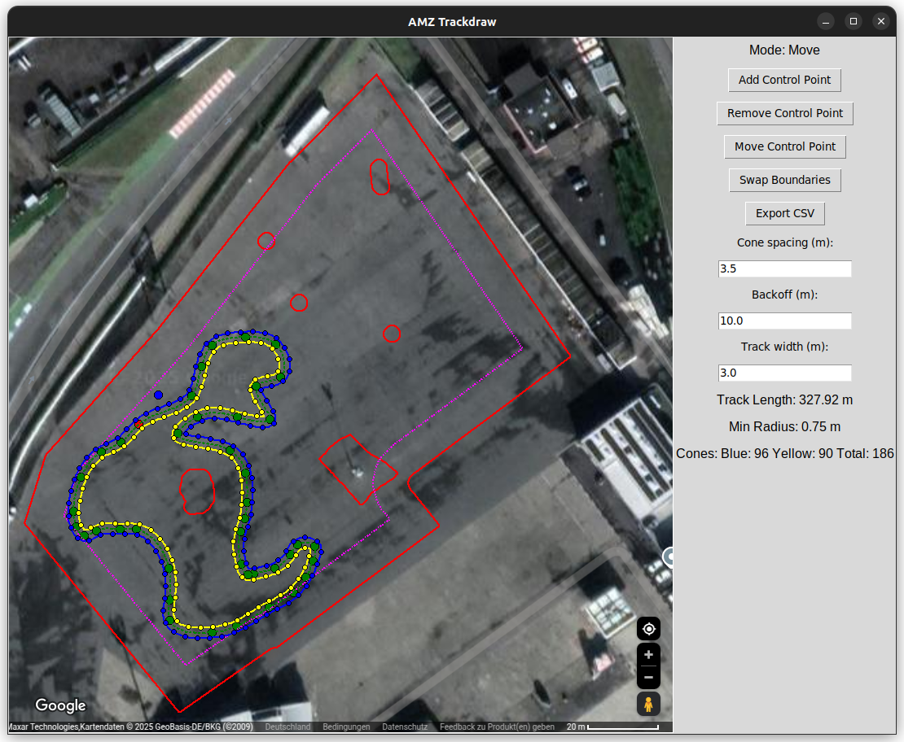

# AMZ Trackdraw

AMZ Trackdraw is a tool designed to help draw driverless racing tracks on 
top of satellite images. The tracks can be exported in CSV format to be used in AMZsim or any other simulator. This tool allows you to define the centerline, boundaries, and cones on a map, taking into account obstacles and free spaces.
Location refers to the "event location" where you want to build your track.



## Getting Started

Follow the steps below to create your track and use it for simulations.

### Prerequisites

Before starting, ensure you have the following:

1. **Python 3** installed with the following dependencies:

   ```bash
   pip install numpy scipy pandas matplotlib opencv-python pillow shapely pyyaml
   ```

2. A **Google Maps** screenshot of your location with the scale legend visible. You will need this for defining the location and scaling.

### Step-by-Step Guide

1. **Screenshot the Location on Google Maps:**
   - Open Google Maps and find the location of the track.
   - Take a screenshot of the area including the scale legend (distance reference).

2. **Create the Occupancy Grid:**
   - Use a drawing tool like **GIMP** to create an occupancy grid on top of your screenshot.
   - The occupancy grid highlights the areas where the track can and cannot go:
     - **Black areas** represent regions where no track should be placed (e.g., obstacles, barriers).
     - **White areas** represent free space for the track.
   - Make sure to:
     1. Draw the obstacles in **pure black**.
     2. Select all black regions, invert the selection, and then fill the selected region with **white**.
   
3. **Calculate Scaling:**
   - Use the scale legend in the screenshot to calculate the scaling factor from **pixels to meters (px/m)**.
   - This scaling factor will be used to convert the pixel-based track drawing into real-world measurements.

4. **Prepare the Location Folder:**
   - Create a folder named after your location in the `/location_images` directory.
   - Inside the folder, place the following files:
     - The **satellite image** (the original Google Maps screenshot).
     - The **occupancy image** (created in step 2).
     - A **config YAML file** containing the file names and the calculated scaling fraction (px/m).
   
   The folder structure should look like this:
   
   ```
   location_images/
   ├── your_loc/
   │   ├── your_loc_satellite_image.png
   │   ├── your_loc_occupancy_image.png
   │   └── your_loc_location_name_config.yaml
   ```

   Example content for the YAML configuration file (`your_location_name_config.yaml`):

   ```yaml
   px_per_m: 10.0  # scaling factor (px/m)
   sat_img_path: 'your_loc_satellite_image.png'
   occ_img_path: 'your_loc_occupancy_image.png'
   ```

5. **Configure the Main Track Configuration:**
   - Open the `track_config.yaml` file located in the `config/` directory.
   - Set the `standard_location` to match the folder name you created in step 4 (e.g., `your_loc`).
   - You can also adjust the default values for track width, cone distance, and boundary backoff in this configuration file.

   Example configuration (`track_config.yaml`):

   ```yaml
   standard_location: "your_loc"
   track_width: 3.0
   cone_distance: 3.5
   min_boundary_backoff: 10.0
   n_points_midline: 300
   ```

6. **Run the Track Drawing Tool:**
   - Execute the following command to start the track creation tool:

   ```bash
   python src/main.py
   ```

   The tool will load the satellite image and display it on a GUI where you can:
   - Add, remove, and move control points on the track.
   - Define the centerline and boundaries.
   - View the track's safe backoff region.
   - Adjust the cone spacing and boundary backoff interactively.

7. **(Optional) Export the Track as a CSV:**
   - Once you've finished defining the track, you can export the track layout as a CSV file. The CSV contains the cone positions along the left and right boundaries, including tags for the cone color.
   - Use the "Export CSV" button in the GUI to save the track layout.
   - The exported CSV can be visualized with `src/plot_csv_track.py`.

   The CSV format will look like this:

   ```csv
   tag,x,y
   blue,2.3,5.1
   yellow,2.5,5.2
   blue,2.7,5.3
   ```

   The coordinates are based on the transformed coordinates from pixels to meters.

### Additional Notes

- **Track Width and Scaling:**
  The `track_width` parameter in the configuration file defines the distance between the left and right boundaries of the track. This value is used to generate the track boundaries based on the centerline.

- **Boundary Backoff:**
  The `min_boundary_backoff` specifies the safe distance from barriers. It ensures that the track is drawn at a sufficient distance away from any barrier.

- **Satellite Image Size:**
  Ensure that the size of the satellite image is preserved when creating the occupancy grid, as the scaling factor depends on the exact pixel dimensions.

### Visualizing the Track

You can visualize the track by plotting the CSV file using the `plot_csv_track.py` script:

```bash
python src/plot_csv_track.py --csv your_exported_track.csv
```

This will display the track layout and allow you to verify the export.

---

By following these steps, you can easily create a track layout on a satellite image and export it for use in a simulator. The tool offers a straightforward way to define racing tracks while considering obstacles and track boundaries.