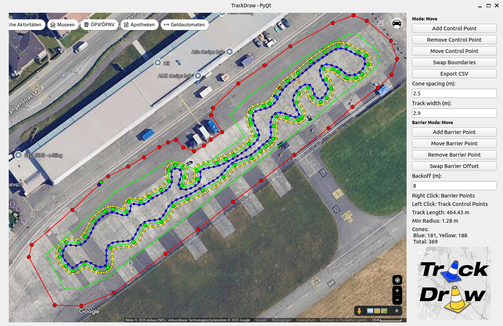

# FS Trackdraw

FS Trackdraw is a tool designed to help draw driverless racing tracks on 
top of satellite images (you can also use a white image if you don't need the "real-world context"). The tracks can be exported in CSV format for a 2D simulator. 
This tool allows you to define the centerline, trackwidth, and the distance between 
consecutive cones. It also lets you draw a barrier of the available space onto the image.



## Feature Ideas
- Randomly generate admissible tracks.
- Load existing CSV-tracks into the satellite image.
- Randomize cone spacings along and normal to the track.

## Getting Started

- Left Mouse Button: Defining the Track (Add, Move, or Remove mode).
- Middle Mouse Button: Panning the image.
- Mouse Wheel: Zooming in on the image.
- Right Mouse Button: Defining the Barrier (Add, Move, or Remove mode).

You can follow the steps below to create your track and use it for simulations.

### Prerequisites

Before starting, ensure you have the following:

1. **Python 3** installed with the following dependencies:

   ```bash
   pip install numpy scipy pandas matplotlib shapely pyyaml PyQt5
   ```

2. A **Google Maps** screenshot of your location with the scale legend visible. You will need this for drawing the track and scaling.

### Step-by-Step Guide

1. **Screenshot the Location on Google Maps:**
   - Open Google Maps and find the location of the track.
   - Take a screenshot of the area including the scale legend (distance reference).

2. **Calculate Scaling:**
   - Use the scale legend in the screenshot to calculate the scaling factor from **pixels to meters (px/m)**.
   - This scaling factor will be used to convert the pixel-based track drawing into real-world measurements.

3. **Prepare the Location Folder:**
   - Create a folder named after your location in the `/location_images` directory.
   - Inside the folder, place the following files:
     - The **satellite image** (the original Google Maps screenshot).
     - A **config YAML file** containing the image file name and the calculated scaling fraction (px/m).
   
   The folder structure should look like this:
   
   ```
   location_images/
   ├── your_loc/
   │   ├── your_loc_satellite_image.png
   │   └── your_loc_location_name_config.yaml
   ```

   Example content for the YAML configuration file (`your_location_name_config.yaml`):

   ```yaml
   px_per_m: 10.0  # scaling factor (px/m)
   sat_img_path: 'your_loc_satellite_image.png'
   ```

4. **Configure the Main Track Configuration:**
   - Open the `track_config.yaml` file located in the `config/` directory.
   - Set the `standard_location` to match the folder name you created in step 3 (e.g., `your_loc`).
   - You can also adjust the default values for track width, cone distance, and boundary backoff in this configuration file.

   Example configuration (`track_config.yaml`):

   ```yaml
   standard_location: "your_loc"
   track_width: 3.0
   cone_distance: 3.5
   min_boundary_backoff: 10.0
   n_points_midline: 300
   ```

6. **Run the Track Drawing Tool:**
   - Execute the following command to start the track creation tool:

   ```bash
   python src/main.py
   ```

   The tool will load the satellite image and display it on a GUI where you can:
   - Add, remove, and move control points that define the track.
   - Zoom in or pan on your image with the *middle mouse button*.
   - Define the centerline via control points of a cubic spline.
   - Adjust the track width.
   - Using the right mouse button, define an outer barrier as a collection of connected line segments by adding, moving, or removing barrier points.
   - Adjust the cone spacing and boundary backoff interactively.

7. **(Optional) Export the Track as a CSV:**
   - After defining the track, export the track layout as a CSV file. The CSV contains the cone positions along the left and right boundaries, including tags for the cone color.
   - Save the track layout by using the "Export CSV" button in the GUI.
   - The exported CSV can be visualized with `src/plot_csv_track.py`.

   The CSV format will look like this:

   ```csv
   tag,x,y
   blue,2.3,5.1
   yellow,2.5,5.2
   blue,2.7,5.3
   ```

   The coordinates are based on the transformed coordinates from pixels to meters.

### Additional Notes

- **Track Width and Scaling:**
  The `track_width` parameter in the configuration file defines the distance between the left and right boundaries of the track. This value is used to generate the track boundaries based on the centerline.

- **Boundary Backoff:**
  The `min_boundary_backoff` specifies the safe distance from barriers. It ensures that the track is drawn at a sufficient distance away from any barrier.

- **Conversion Factor:**
  Ensure that the scaling factor is correct and yields reasonable distances in the exported .csv file.

### Visualizing the Track

You can visualize the track by plotting the CSV file using the `plot_csv_track.py` script:

```bash
python src/plot_csv_track.py --csv your_exported_track.csv
```

This will display the track layout and allow you to verify the export.

---

By following these steps, you can easily create a track layout on a satellite image and export it for use in a simulator. The tool offers a straightforward way to define racing tracks while considering barriers defined as polygons and visual obstacles defined via the satellite image.
